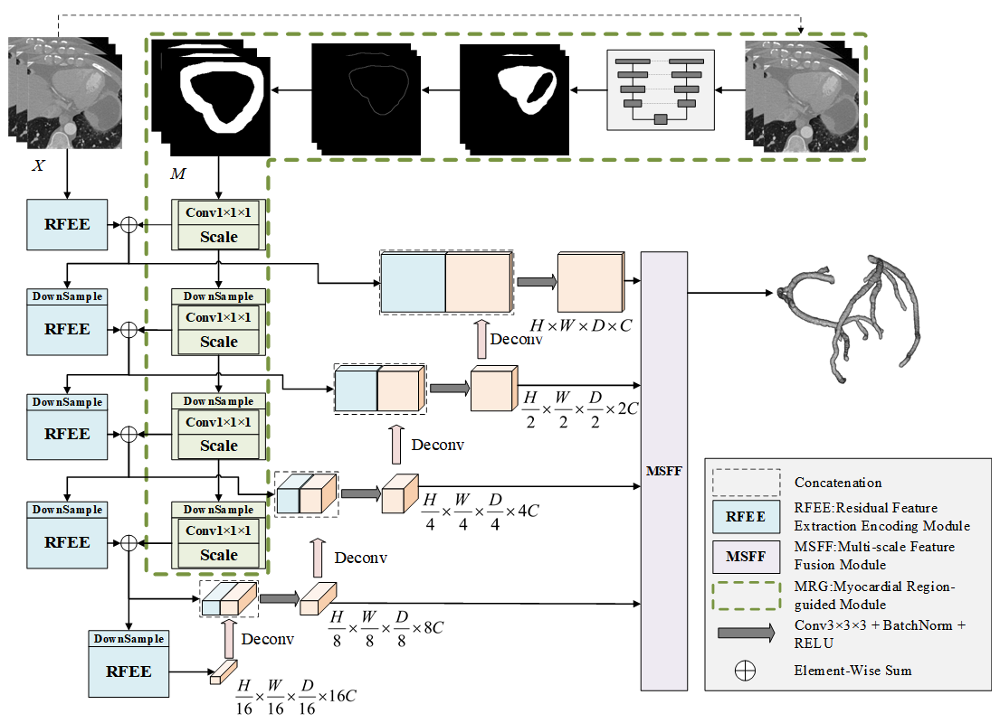

# Automatic segmentation and stenosis assessment of coronary arteries in coronary computed tomography angiography

Ni Yao1, Xiangyu Liu1, Danyang Sun1, Chuang Han1, Yanting Li1, Jiaofen Nan1, Chengyang Li2, Fubao Zhu1, Weihua Zhou3,4*, Chen Zhao5*

1. School of Computer Science and Technology, Zhengzhou University of Light Industry, Zhengzhou 450001, Henan, China 
2. School of Information Management and Engineering, Shanghai University of Finance and Economics, China 
3. Department of Applied Computing, Michigan Technological University, Houghton, MI, USA 
4. Center for Biocomputing and Digital Health, Institute of Computing and Cybersystems, and Health Research Institute, Michigan Technological University, Houghton, MI, USA
5. Department of Computer Science, Kennesaw State University Marietta, GA, USA

*Correspondence: 
Weihua Zhou, Ph.D.
Assistant Professor
Department of Applied Computing
Michigan Technological University, Houghton, MI, USA
Email: whzhou@mtu.edu


Chen Zhao, Ph.D.
Assistant Professor
Department of Computer Science
Kennesaw State University Marietta, GA, USA
Email: czhao4@kennesaw.edu


## Network



## Dataset

### Notes on Data Usage
- The author has made the dataset publicly available on https://www.kaggle.com/xiaoweixumedicalai/datasets?scroll=true!
- Please send emails to me `xiao.wei.xu@foxmail.com` for the link and the password to download the dataset and the benchmark.

### Data Format
- NIfTI-format Data can be processed by `data_process.py` under the directory `utils`, with the output directory being your dataset `root/data`.
- Cardiac data processing can be done by `Myo_process/save_contour.py` and `Myo_process/process.py`.


**Example Directory Structure**:
```
ROOT/DATA 
├── train/ 
│   ├── data/ 
│   │   ├── id0_seq0_img.nii.gz 
│   │   ├── id0_seq1_img.nii.gz 
│   │   ├── ... 
│   │   ├── id1_seq0_img.nii.gz 
│   │   ├── ... 
│   ├── contours/  
│   │   ├── id0_seq0_label.nii.gz 
│   │   ├── id0_seq1_label.nii.gz 
│   │   ├── ... 
│   │   ├── id1_seq0_label.nii.gz 
│   │   ├── ... 
│   ├── mask/  
│   │   ├── id0_seq0_label.nii.gz 
│   │   ├── id0_seq1_label.nii.gz 
│   │   ├── ... 
│   │   ├── id1_seq0_label.nii.gz 
│   │   ├── ... 
├── ...
├── train.txt 
├── val.txt 
├── test.txt 

```

## Dependencies

Install the dependencies using the provided `requirements.txt`:
```
pip install -r requirements.txt
```
### Key Dependencies
- PyTorch
- nibabel
- NumPy
- tqdm
- scikit-learn

## Usage

### 1. Training and Validation
Update the parameters in the `trainer. py` file:

```yaml
base_dir: "your project root"
train_dir: "your data root"
val_dir: "your data root"
epoch: 200
...
```
Run the training script:
```
python trainer.py
```

### 2. Testing

After the training is completed, you can run test.py for testing, including prediction and calculation of Dice, recall，precision，hd95.
The final result can be saved in `.nii.gz` format

### 3. Outputs

During training and evaluation, outputs are saved in the specified `exp_log` directory:
- **checkpoints**: Best model weights (`checkpoint_best.pth`) and other (`checkpoint_{epoch_number}.pth`).
- **logs**: Training, validation logs.
- **writer**: Draw loss and dice curves for training and validation.

### 4. Stenosis Detection

You need to organize the files of the predicted results or ground truth according to the `stenosis_detection/samples` directory.
- Update `stenosis_detection/mainprocess.py` and run it.
- The necessary intermediate variables in the calculation process will be retained in each data folder.
- The stenosis point and degree will be saved as an `.xlsx` file

## Performances

### 1. Segmentation

| Network                | Dice(%) | Precision(%) | Recall(%) | HD95(mm)  |
|------------------------|---------|--------------|-----------|-----------|
| Unet 3D[10]            | 81.47   | 79.69        | 83.95     | 15.9125   |
| DenseVoxelNet[12]      | 82.63   | 83.53        | 82.19     | 12.0250   |
| V-net[11]              | 82.94   | 81.23        | 85.28     | 12.8953   |
| CS2-Net[13]            | 83.29   | 82.41        | 84.68     | 8.1108    |
| ​**​MGFA-UQ (Ours)​**​ | 85.04   | 84.24        | 86.27     | 6.1294    |

### 2. Stenosis Detection

| Segmentation Model | Stenosis Type | TPR    | PPV    | ARMSE   | RRMSE   |
|--------------------|---------------|--------|--------|---------|---------|
| ​**​U-net 3D​**​       | All           | 0.4330 | 0.4251 | 0.1574  | 0.4064  |
|                    | minimal       | 0.4774 | 0.4842 | 0.1626  | 0.3409  |
|                    | mild          | 0.4240 | 0.4328 | 0.1319  | 0.3447  |
|                    | moderate      | 0.4298 | 0.3891 | 0.1710  | 0.5054  |
|                    | severe        | 0.3243 | 0.3918 | 0.3504  | 0.9027  |
| ​**​DenseVoxelNet​**​  | All           | 0.4268 | 0.4444 | 0.1617  | 0.4042  |
|                    | minimal       | 0.4427 | 0.4220 | 0.1581  | 0.3162  |
|                    | mild          | 0.4267 | 0.4097 | 0.1338  | 0.3457  |
|                    | moderate      | 0.4171 | 0.4700 | 0.1921  | 0.5418  |
|                    | severe        | 0.3919 | 0.4594 | 0.3199  | 0.7046  |
| ​**​V-net​**​          | All           | 0.4374 | 0.4630 | 0.1605  | 0.3989  |
|                    | minimal       | 0.4462 | 0.4691 | 0.1549  | 0.3160  |
|                    | mild          | 0.4327 | 0.4416 | 0.1385  | 0.3488  |
|                    | moderate      | 0.4531 | 0.4027 | 0.1552  | 0.3811  |
|                    | severe        | 0.3649 | 0.3919 | 0.4122  | 1.1696  |
| ​**​CS2-Net​**​        | All           | 0.4351 | 0.4577 | 0.1557  | 0.4072  |
|                    | minimal       | 0.4527 | 0.4642 | 0.1624  | 0.3349  |
|                    | mild          | 0.4349 | 0.4135 | 0.1232  | 0.3168  |
|                    | moderate      | 0.4187 | 0.4279 | 0.1907  | 0.5720  |
|                    | severe        | 0.4324 | 0.4595 | 0.2834  | 0.7553  |
| ​**​MGFA-Net​**​       | All           | 0.4564 | 0.4797 | 0.1537  | 0.3865  |
|                    | minimal       | 0.4414 | 0.4684 | 0.1614  | 0.3077  |
|                    | mild          | 0.4618 | 0.4407 | 0.1215  | 0.3067  |
|                    | moderate      | 0.4638 | 0.4819 | 0.1849  | 0.5077  |
|                    | severe        | 0.4189 | 0.4729 | 0.2983  | 0.8471  |